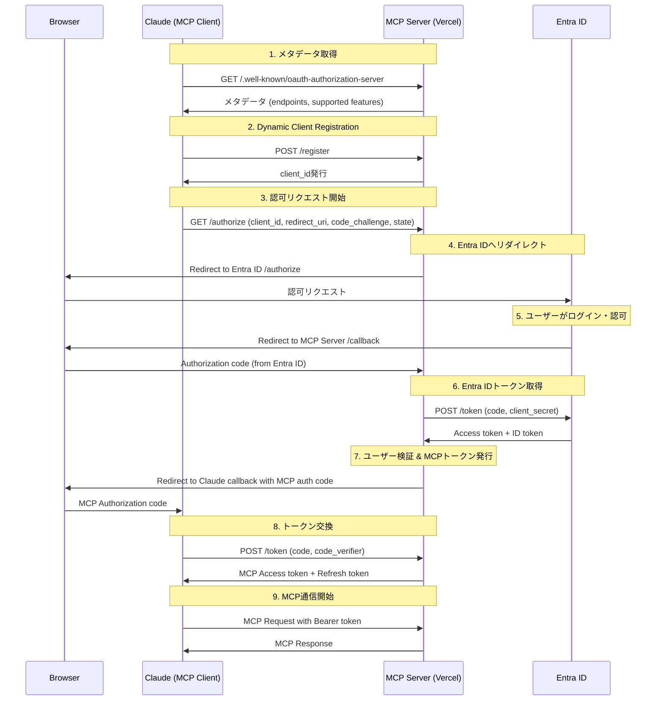
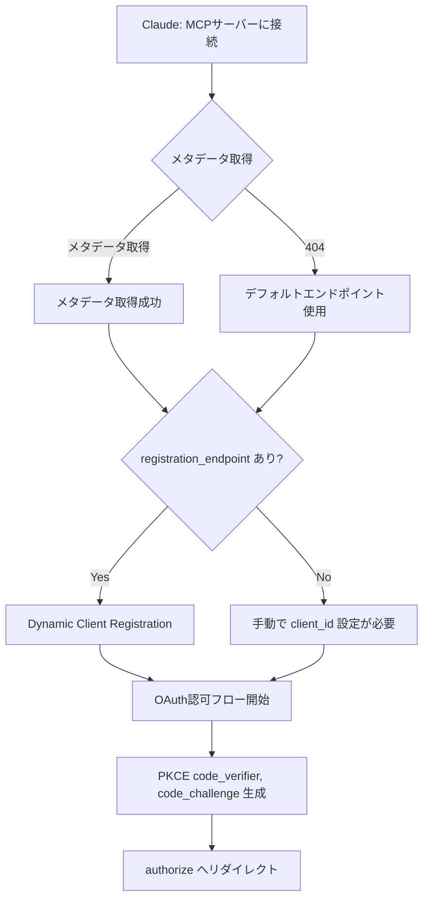
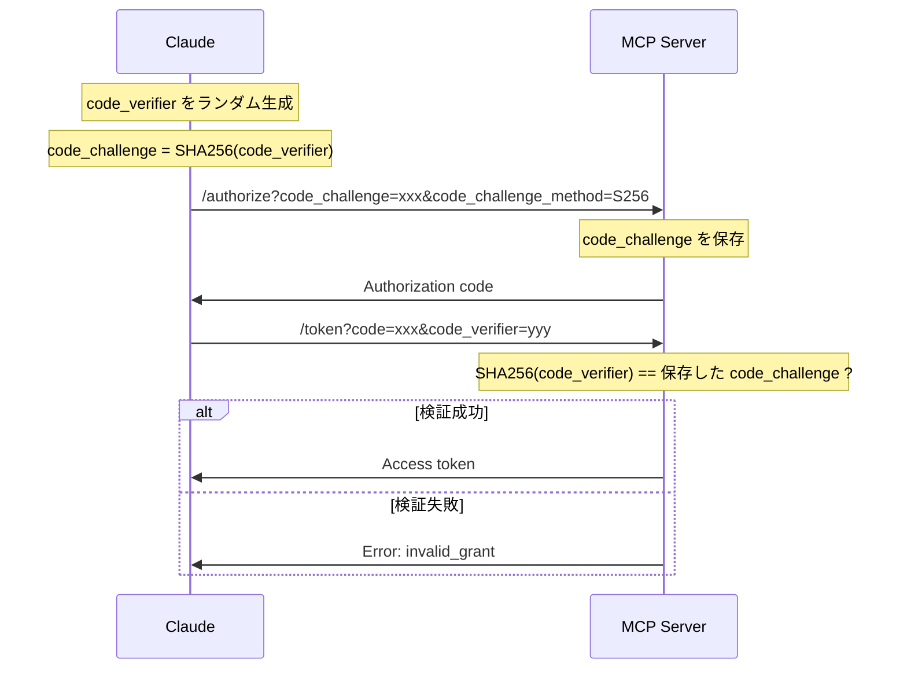

# MCP Auth Server

> このリポジトリは [MCP Authorization Specification](https://modelcontextprotocol.io/specification/2025-03-26/basic/authorization) を参考に、MCPにOAuth 2.0認証を実装した練習リポジトリです。

研究室メンバー限定のMCPサーバー。Entra ID（Azure AD）を使った認証と、メンバーリストによる認可を組み合わせています。

## アーキテクチャ

```
Claude ←→ MCPサーバー（Vercel）←→ Entra ID
             │
             ▼
       研究室メンバーDB
       （JSONファイル）
```

## 認証フロー

このリポジトリは MCP Authorization Specification の **Third-Party Authorization Flow** を実装しています。MCPサーバーが Claude に対しては認可サーバーとして、Entra ID に対してはOAuthクライアントとして動作します。

### 全体フロー



### メタデータ取得フロー



### PKCE (Proof Key for Code Exchange)



## セットアップ

### 1. Entra ID アプリケーション登録

1. [Azure Portal](https://portal.azure.com/) > App registrations > 新規登録
2. 名前を入力（例：lab-mcp-server）
3. サポートされるアカウントの種類を選択（Single tenant 推奨）
4. リダイレクトURIを設定：`https://<your-app>.vercel.app/callback`
5. Certificates & secrets でClient Secretを作成
6. 以下の値をメモ：
   - Application (client) ID
   - Directory (tenant) ID
   - Client Secret

### 2. 環境変数の設定

Vercelで以下の環境変数を設定（`.env.sample` 参照）：

| 変数名 | 説明 |
|--------|------|
| `AZURE_CLIENT_ID` | Application (client) ID |
| `AZURE_CLIENT_SECRET` | Client Secret |
| `AZURE_TENANT_ID` | Directory (tenant) ID |
| `JWT_SECRET` | JWTの署名キー（`openssl rand -base64 32` で生成） |
| `ALLOWED_MEMBERS` | 許可するメンバーのメールアドレス（カンマ区切り） |

例：
```bash
ALLOWED_MEMBERS=tanaka@xxx.ac.jp,suzuki@xxx.ac.jp,yamada@xxx.ac.jp
```

**注意**: `ALLOWED_MEMBERS` が未設定の場合、全ユーザーがアクセス可能になります（テスト用）。

### メンバーの追加・削除

メンバーを追加・削除するには、Vercelの環境変数 `ALLOWED_MEMBERS` を更新します。

**CLIで更新する場合：**

```bash
# 既存の環境変数を削除
npx vercel env rm ALLOWED_MEMBERS production -y

# 新しいメンバーリストを追加（カンマ区切り）
echo -n "member1@example.ac.jp,member2@example.ac.jp,newmember@example.ac.jp" | npx vercel env add ALLOWED_MEMBERS production

# 再デプロイ
npx vercel --prod
```

**ダッシュボードで更新する場合：**

1. [Vercel Dashboard](https://vercel.com) → プロジェクト → Settings → Environment Variables
2. `ALLOWED_MEMBERS` を編集
3. Deployments → 最新のデプロイを Redeploy

### 未登録ユーザーがログインした場合

`ALLOWED_MEMBERS` に登録されていないメールアドレスでログインすると、以下のエラーが表示されます：

```json
{
  "error": "access_denied",
  "error_description": "You are not a member of this lab"
}
```

### 3. デプロイ

```bash
npm install
vercel --prod
```

## Claude での設定

### Claude Code (CLI)

以下のコマンドでMCPサーバーを追加：

```bash
claude mcp add --transport http lab-mcp https://mcp-auth-server.vercel.app/api/mcp
```

追加後、`/mcp` コマンドで認証を開始できます。初回はEntra IDのログイン画面が表示されます。

### Claude.ai (Web)

Claude.aiの設定画面からMCPサーバーを追加：

```
Server URL:     https://mcp-auth-server.vercel.app/api/mcp
Authentication: OAuth 2.0
```

※ Dynamic Client Registrationに対応しているため、Client IDは自動で発行されます。

## エンドポイント

| パス | メソッド | 説明 |
|------|----------|------|
| `/.well-known/oauth-authorization-server` | GET | OAuth メタデータ |
| `/.well-known/oauth-protected-resource` | GET | Protected Resource メタデータ |
| `/register` | POST | Dynamic Client Registration |
| `/authorize` | GET | OAuth認可リクエスト受付 |
| `/callback` | GET | Entra IDからのコールバック |
| `/token` | POST | トークン発行 |
| `/api/mcp` | GET/POST | MCPプロトコル |

## 利用可能なツール

### generate_image

テキストプロンプトから画像を生成します。

```json
{
  "name": "generate_image",
  "arguments": {
    "prompt": "A beautiful sunset over the ocean",
    "size": "1024x1024",
    "style": "natural"
  }
}
```

**注意**: 現在はプレースホルダー実装です。実際の画像生成APIと連携するには `src/mcp/tools/imageGen.ts` を編集してください。

## 開発

```bash
# ローカル開発
npm run dev

# ビルド
npm run build
```

## セキュリティ

- PKCE必須
- JWTによるトークン管理（アクセストークン: 1時間、リフレッシュトークン: 7日）
- メンバーリストによる認可
- HTTPS必須（Vercelがデフォルトで対応）
